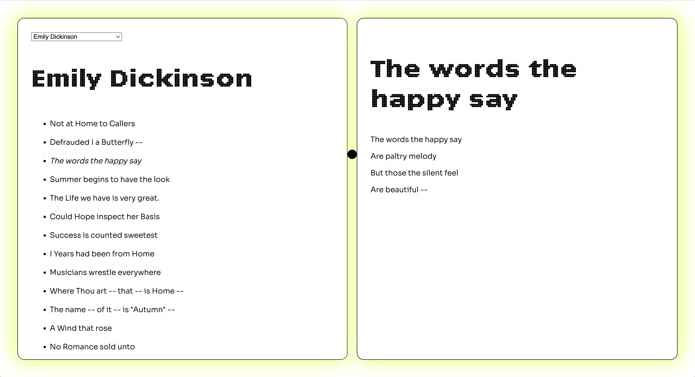
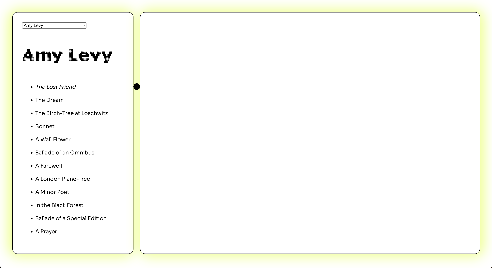
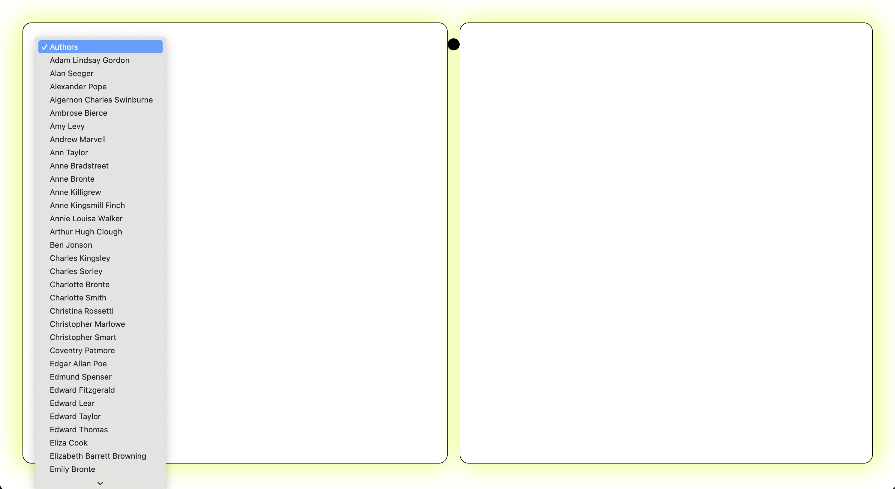

# Poetry Reader

A simple, responsive poetry reader, made using poetryDB.org API. The design envokes full stops -- the draggable dot in the middle of the screen, the title font and the rounded corners. 

## Features:

⚫️ A select box with authors' names;   

⚫️ A draggable split screen with a dot that follows the cursor vertically;  

⚫️ A list of clickable titles.

## Select Images:

  
  

## Shoutout

Special thanks to the PoetryDB API for making the humanities free and accessible on the web. Visit their page here: [PoetryDB website link](https://poetrydb.org/index.html)
